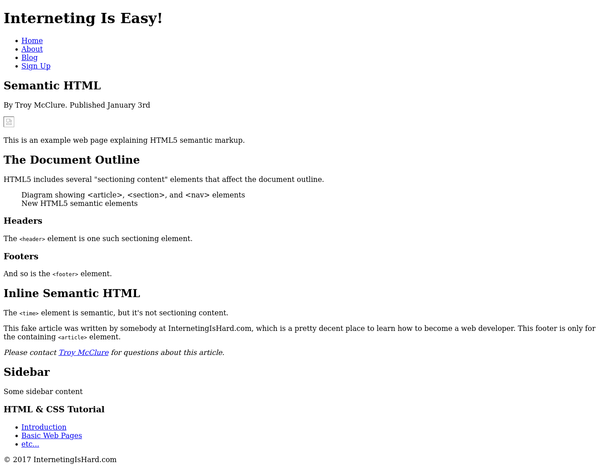

# Interneting Is Hard - Semantic HTML

This is a solution to the [Semantic HTML tutorial No. 12 of HTML & CSS Is Hard](https://www.internetingishard.com/html-and-css/semantic-html/).

## Table of contents

- [Overview](#overview)
  - [Screenshot](#screenshot)
  - [Links](#links)
- [My process](#my-process)
  - [Built with](#built-with)
  - [What I learned](#what-i-learned)
  - [Continued development](#continued-development)
  - [Useful resources](#useful-resources)
- [Author](#author)
- [Acknowledgments](#acknowledgments)

## Overview

### Screenshot



### Links

- Solution URL: [Semantic HTML solution](https://github.com/jugglingdev/semantic-html)
- Live Site URL: [Semantic HTML live site](https://jugglingdev.github.io/semantic-html/)

## My process

### Built with

- Semantic HTML5 markup

### What I learned

This tutorial was actually very simple because of the way Interneting Is Hard introduced `<div>s` at the beginning.  Since we were already working with boxes within boxes within boxes, it made a lot of sense to then apply a specific tag name to each container to improve the semantics of the page.

The semantic structures covered in this tutorial include:
- headings (`<h1>` to `<h6>`)
- article
- section
- nav
- header
- footer
- aside
- time
- address
- figure
- figcaption

Headings help create an outline for the document and `<article>` is for content that can be distributed to a search engine, an app like Flipboard, or another website.

When working with sections, it's best to still define a page's outline with headings and use `<section>` as a container for layout purposes (like a more descriptive `<div>`).

The `<header>` typically includes the website's name, logo, and main `<nav>`.  Here, there's one `<header>` for the website and another for the `<article>`.

The `<footer>` generally includes copyright, footer `<nav>`, and author bios.  Once again, there's a `<footer>` for the `<article>` and one for the website.

The `<aside>` is great for definitions, stats, and quotes inside an article.  Outside an article, it's great for making a sidebar.

For a time of day or calendar date, use `<time>` tags with the `datetime` attribute.  You can include just the date (year-month-day) or also the time and timezone like so:

```html
<time datetime="2017-1-3 15:00-0800">January 3rd</time>
```

The `<address>` defines the author's contact info (NOT a physical address, though):

```html
<address>
  Please contact <a href="mailto:troymcclure@example.com">Troy McClure</a> for questions about this article.
</address>
```
Wrapping up the semantic elements, `<figure>` is often used for diagrams, illustrations, and code snippets.  Meanwhile, `<figcaption>` adds a visible description to an `` element (remember that `alt` is a text replacement for screen readers or unloadable images).

Finally, many global CSS stylesheets include the following code for legacy browsers that don't recognize HTML5 semantic elements (and tell them to behave like `<div>s`):

```css
section, article, aside, footer, header, nav {
  display: block;
}
```
### Continued development

Not surprisingly, this tutorial only touched the surface of semantic meaning.  Reaching closer to technical SEO, there are other resources like schema.org and other as listed in Useful Resources below that I'd like to explore in the future.

### Useful resources

- [HTML5 Outliner](https://gsnedders.html5.org/outliner/) - This is a neat tool for inspecting a page's outline.  There are 3 ways to submit the HTML.

- [Schema.org Microdata](https://schema.org/docs/gs.html) - Want to change how you site appears in search engine results?  Go here.

- [Twitter Cards](https://developer.twitter.com/en/docs/twitter-for-websites/cards/guides/getting-started) - This one's for changing web page display in tweets.

- [Open Graph Metadata](https://developers.facebook.com/docs/sharing/webmasters#markup) - And this one's for sharing on Facebook.

## Author

- GitHub - [@jugglingdev](https://github.com/jugglingdev)

- freeCodeCamp - [@jugglingdev](https://www.freecodecamp.org/jugglingdev)

- Frontend Mentor - [@jugglingdev](https://www.frontendmentor.io/profile/jugglingdev)

- LinkedIn - [Kayla Paden](https://www.linkedin.com/in/kayla-marie-paden)

## Acknowledgments

Shoutout to Oliver James for his dedication to publishing and maintaining InternetingIsHard.com.  His tutorials were the first that really clicked for me.